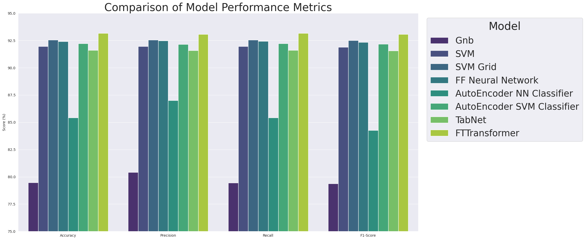
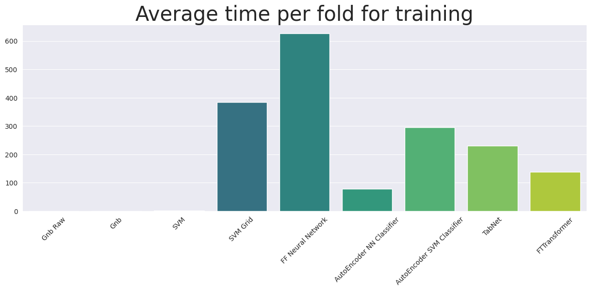

In this final project for the Machine Learning for Data Science course, we have explored and extended various models 
covered during the lessons, applying them to an industrial problem. Our primary challenge involved implementing neural 
networks for tabular data, a less common approach, as neural networks are typically employed for other types of data.  
With Steel Plates Faults dataset (available on the [UCI Machine Learning repository](https://archive.ics.uci.edu/dataset/198/steel+plates+faults)), 
we aim to accurately classify surface defects in stainless steel plates, encompassing seven distinct defect types. 
The input vector consists of 27 indicators that approximately describe the geometric characteristics of the defects and 
their shapes. 

Following an exploratory data analysis, which highlights a significant class imbalance, different 
techniques for class balancing will be applied. In particular, the SmoteNC algorithm is used to balance the target 
classes, while a conditional GAN for tabular data is applied to generate synthetic data, beneficial to the deep learning
models. After evaluating traditional machine learning models, the primary challenge of this study is to achieve high 
accuracy by adapting conventional neural network architectures, which are typically less suited for tabular data. 
Ultimately, the findings will demonstrate that with appropriate adjustments, these models can also achieve competitive
results.

The main models we have used in this project are:
- Gaussian Naive Bayes Classifier
- Support Vector Classifier
- Feed Forward Neural Network
- AutoEncoder for dimensionality reduction with an SVM trained on the latent features
- TabNet
- FTTransformer

The final metrics for the models' predictions and the average training time are displayed in the following plots.

